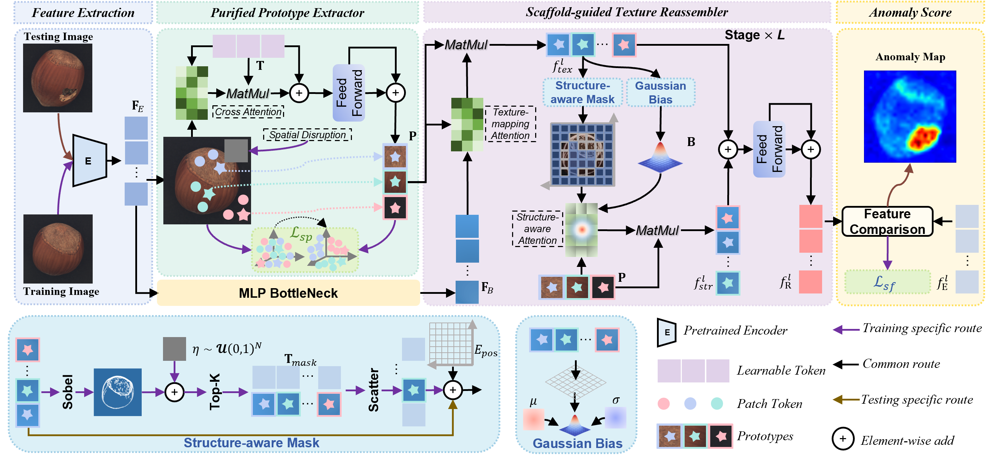

# STAR
> - The official PyTorch implementation of Scaffold-guided Texture Alignment and Reassembly for Multi-class Unsupervised Anomaly Detection    

> - STAR is built upon the pioneering work of [INPformer](https://github.com/luow23/INP-Former), to which we express our sincere gratitude for their inspiring and foundational contributions.

## Abstract
Existing Multi-class Unsupervised Anomaly Detection (MUAD) methods that reconstruct inputs must represent the normality of diverse products, which invites identity mapping and leaks anomalies into the output. 
Prototype-based methods mitigate this by reconstructing from normal prototypes rather than raw inputs, achieving strong MUAD performance. 
However, existing prototype-based methods are constrained by spatial binding: their prototypes remain tied to specific image locations. 
Although these methods successfully capture normal patterns, they implicitly encode spatial context, which compromises the representation of abstract texture patterns. 
Consequently, when texture locations vary, the reconstructed spatial layout suffers from blurring. 
We argue that textures, as semantic patterns, benefit from abstraction, which curbs identity mapping by eliminating pixel-wise copying. 
In contrast, structures, as deterministic layouts, benefit from explicit encoding that mitigates structural blurring through spatial priors. 
Motivated by this, we propose Scaffold-guided Texture Alignment and Reassembly (STAR). 
Specifically, we introduce a Purified Prototype Extractor that applies aggressive masking to disrupt the positional continuity of normal tokens, and then captures position-agnostic normal texture prototypes from the visible ones. 
A Semantic Purity Loss constrains these prototypes to retain semantic fidelity. 
We further propose a Scaffold-guided Texture Reassembler, which first queries the prototypes via semantic matching and then reassembles them into a spatially coherent, structure-anchored representation under the guidance of a self-distilled scaffold.
Since structural boundaries are challenging to anchor accurately, a Structural Fidelity Loss is introduced to focus optimization on these critical regions. 
Experiments on MVTec-AD, VisA, and Real-IAD demonstrate that STAR achieves state-of-the-art multi-class anomaly detection performance and generalizes effectively in few-shot settings. 

## Overview
<p align="center">
  
</p>

## Install Environments

Create a new conda environment and install required packages.

```
conda create -n star python=3.10
conda activate star
pip install -r requirements.txt
```
Experiments are conducted on NVIDIA A100 (40GB). Same GPU and package version are recommended. 

## Prepare Datasets
Noted that `../` is the upper directory of INP-Former code. It is where we keep all the datasets by default.
You can also alter it according to your need, just remember to modify the `data_path` in the code. 

### MVTec AD

Download the MVTec-AD dataset from [URL](https://www.mvtec.com/company/research/datasets/mvtec-ad).
Unzip the file to `../mvtec_anomaly_detection`.
```
|-- mvtec_anomaly_detection
    |-- bottle
    |-- cable
    |-- capsule
    |-- ....
```


### VisA

Download the VisA dataset from [URL](https://github.com/amazon-science/spot-diff).
Unzip the file to `../VisA/`. Preprocess the dataset to `../VisA_pytorch/` in 1-class mode by their official splitting 
[code](https://github.com/amazon-science/spot-diff). `../VisA_pytorch` will be like:
```
|-- VisA_pytorch
    |-- 1cls
        |-- candle
            |-- ground_truth
            |-- test
                    |-- good
                    |-- bad
            |-- train
                    |-- good
        |-- capsules
        |-- ....
```
 
### Real-IAD
Contact the authors of Real-IAD [URL](https://realiad4ad.github.io/Real-IAD/) to get the net disk link.

Download and unzip `realiad_1024` and `realiad_jsons` in `../Real-IAD`.
`../Real-IAD` will be like:
```
|-- Real-IAD
    |-- realiad_1024
        |-- audiokack
        |-- bottle_cap
        |-- ....
    |-- realiad_jsons
        |-- realiad_jsons
        |-- realiad_jsons_sv
        |-- realiad_jsons_fuiad_0.0
        |-- ....
```

### Options
- `dataset`: names of the datasets, MVTec-AD, VisA, or Real-IAD
- `data_path`: path to the dataset
- `encoder`: name of the pretrained encoder
- `input_size`: size of the image after resizing
- `crop_size`: size of the image after center cropping
- `P_num`: number of Prototypes
- `total_epochs`: number of training epochs
- `batch_size`: batch size
- `phase`: mode, train or test
- `shot`: number of samples per class in the few-shot setting
### Multi-Class Setting
<details>
<summary>
MVTec-AD
</summary>

#### Train:
```
python STAR_mc.py --dataset MVTec-AD --data_path ../mvtec_anomaly_detection --phase train
```
#### Test:
```
python STAR_mc.py --dataset MVTec-AD --data_path ../mvtec_anomaly_detection --phase test
```
</details>

<details>
<summary>
VisA
</summary>

#### Train:
```
python STAR_mc.py --dataset VisA --data_path ../VisA_pytorch/1cls --phase train
```
#### Test:
```
python STAR_mc.py --dataset VisA --data_path ../VisA_pytorch/1cls --phase test
```
</details>

<details>
<summary>
Real-IAD
</summary>

#### Train:
```
python STAR_mc.py --dataset Real-IAD --data_path ../Real-IAD --phase train
```
#### Test:
```
python STAR_mc.py --dataset Real-IAD --data_path ../Real-IAD --phase test
```
</details>

### Few-Shot Setting
<details>
<summary>
MVTec-AD
</summary>

#### Train:
```
python STAR_fs.py --dataset MVTec-AD --data_path ../mvtec_anomaly_detection --shot 4 --phase train
```
#### Test:
```
python STAR_fs.py --dataset MVTec-AD --data_path ../mvtec_anomaly_detection --shot 4 --phase test
```
</details>

<details>
<summary>
VisA
</summary>

#### Train:
```
python STAR_fs.py --dataset VisA --data_path ../VisA_pytorch/1cls --shot 4 --phase train
```
#### Test:
```
python STAR_fs.py --dataset VisA --data_path ../VisA_pytorch/1cls --shot 4 --phase test
```
</details>

<details>
<summary>
Real-IAD
</summary>

#### Train:
```
python STAR_fs.py --dataset Real-IAD --data_path ../Real-IAD --shot 4 --phase train
```
#### Test:
```
python STAR_fs.py --dataset Real-IAD --data_path ../Real-IAD --shot 4 --phase test
```
</details>


### Super-Multi-Class Setting
<details>
<summary>
MVTec-AD+VisA+Real-IAD
</summary>

#### Train:
```
python STAR_sup.py --mvtec_data_path ../mvtec_anomaly_detection --visa_data_path ../VisA_pytorch/1cls --real_iad_data_path ../Real-IAD --phase train 
```
#### Test:
```
python STAR_sup.py --mvtec_data_path ../mvtec_anomaly_detection --visa_data_path ../VisA_pytorch/1cls --real_iad_data_path ../Real-IAD --phase test 
```
</details>


## Results
The INPformer original authors noted that, similar to [Dinomaly](https://github.com/guojiajeremy/Dinomaly), their INP-Former had slight inaccuracies when using the GT mask (see this [issue](https://github.com/guojiajeremy/Dinomaly/issues/14).). After fixing the issue, they stated that the pixel-level AP and F1-max results from the current code may be slightly lower than the metrics reported in their paper. Our experiments use their post-fix code, which is why the metrics reported in this paper are slightly lower than those in the original paper.

### Multi-Class Setting and Super-Multi-Class Setting
<p align="center">
  
</p>

### Few-Shot Setting
<p align="center">
  
</p>
<p align="center">
  
</p>


## Acknowledgements
We sincerely appreciate [INPformer](https://github.com/luow23/INP-Former) for its concise, effective, and easy-to-follow approach. We also thank [Reg-AD](https://github.com/MediaBrain-SJTU/RegAD), as the data augmentation techniques used in our few-shot setting were inspired by it. We further acknowledge [OneNIP](https://github.com/gaobb/OneNIP) for inspiring our super-multi-class experiments. 

## Contact
If you have any questions about our work, please do not hesitate to contact [chenjiechenjiejc@163.com](mailto:chenjiechenjiejc@163.com).


